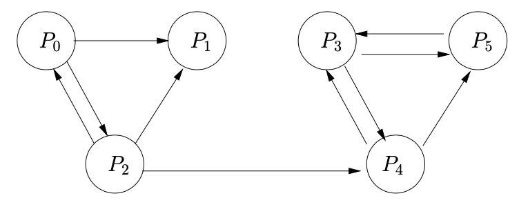

---
##### pandoc -s rapport.md -o rapport.pdf
lang: fr-FR
title: Projet Programmation Impérative
subtitle: Calcul efficace du PageRank
author: Julien Blanchon (AB-15)
date: 16-01-2020
abstract: | 
  Ceci est un rapport de présentation et de discussion sur une implémentation d'un algorithme de PageRank. Nous allons premièrement un peu de théorie sur l'algorithme PageRank puis ensuite l'architecture de deux implémentations, l'une avec une matrice dite "pleine" (`pagerank_t`) et l'autre avec une matrice dite "creuse" (`pagerank_c`). Les principaux choix et algorithme utilisé seront présentés ainsi que des benchmarks des deux implémentations sur des réseaux tests.
keywords: [pagerank, ada]
output: 
  pdf_document:
    path: rapport.pdf
# include-before: |
#     See these lines
#     Come __before__ the [toc](/dev/null)
toc-title: Table des matières
toc: true
toc_depth: 2
#include-after: |
#    See these lines
#    Come __after__ the [article](/dev/null)
fontsize: 12pt #10, 11 ou 12pt seulement
# Voir https://tug.org/FontCatalogue/ et https://fonts.google.com/ pour les Fonts
# mainfont: "Merriweather"
# sansfont: "Raleway"
# monofont: "IBM Plex Mono"
# mathfont:
documentclass: article # Voir https://en.wikibooks.org/wiki/LaTeX/Document_Structure#Document_classes pour les class et classoption
classoption: [notitlepage, onecolumn, openany]
geometry: [a4paper, bindingoffset=0mm, inner=30mm, outer=30mm, top=30mm, bottom=30mm] # Voir https://ctan.org/pkg/geometry pour les options geometry
# papersize: a4
header-includes:
  ### Format encodage
  - \usepackage[utf8]{inputenc}  
  - \usepackage[T1]{fontenc} 
  ### Format algorithm2e
  - \usepackage[ruled,vlined,linesnumbered]{algorithm2e}
  - \SetKwProg{Exception}{exception}{}{end}
  - \SetKwProg{progll}{=$>$}{}{}
  - \SetAlgoLined
  - \DontPrintSemicolon
  - \SetKwInOut{Input}{Input}
  - \SetKwInOut{Output}{Output}
  ### Format Code Ada
  - \usepackage{listings}  # Package pour les blocks code (https://en.wikibooks.org/wiki/LaTeX/Source_Code_Listings)
  - \lstset{language=Ada}
  - \usepackage{tcolorbox}
  - \usepackage{fullpage}
  - \usepackage{color}
  - \definecolor{greenAda}{rgb}{0,0.6,0}
  - \definecolor{grayAda}{rgb}{0.5,0.5,0.5}
  - \definecolor{mauveAda}{rgb}{0.58,0,0.82}
  - \definecolor{purpleAda}{rgb}{0.38,0.68,0.93}
  - \lstset{
    basicstyle=\tiny,
    breaklines=true,
    numbers=left,
    numberstyle=\tiny,
    frame=tb,
    tabsize=4,
    columns=fixed,
    showstringspaces=false,
    showtabs=false,
    keepspaces,
    backgroundcolor=\color{white},
    commentstyle=\color{mauveAda},
    keywordstyle=\color{greenAda},
    stringstyle=\color{purpleAda} 
      }
  - \lstset{
    inputencoding = utf8,
    extendedchars = true,
    literate      =      
      {á}{{\'a}}1  {é}{{\'e}}1  {í}{{\'i}}1 {ó}{{\'o}}1  {ú}{{\'u}}1
      {Á}{{\'A}}1  {É}{{\'E}}1  {Í}{{\'I}}1 {Ó}{{\'O}}1  {Ú}{{\'U}}1
      {à}{{\`a}}1  {è}{{\`e}}1  {ì}{{\`i}}1 {ò}{{\`o}}1  {ù}{{\`u}}1
      {À}{{\`A}}1  {È}{{\'E}}1  {Ì}{{\`I}}1 {Ò}{{\`O}}1  {Ù}{{\`U}}1
      {ä}{{\"a}}1  {ë}{{\"e}}1  {ï}{{\"i}}1 {ö}{{\"o}}1  {ü}{{\"u}}1
      {Ä}{{\"A}}1  {Ë}{{\"E}}1  {Ï}{{\"I}}1 {Ö}{{\"O}}1  {Ü}{{\"U}}1
      {â}{{\^a}}1  {ê}{{\^e}}1  {î}{{\^i}}1 {ô}{{\^o}}1  {û}{{\^u}}1
      {Â}{{\^A}}1  {Ê}{{\^E}}1  {Î}{{\^I}}1 {Ô}{{\^O}}1  {Û}{{\^U}}1
      }
  

---
\clearpage

# Introduction:

L'algorithme de PageRank est un algorithme d'analyse de graphes orientés dont l'objectif est de trier les noeuds selon leurs réputations c'est-à-dire selon leurs popularités (nombre de liens vers le noeud) mais aussi leurs respectabilités (réputations relatives des noeuds liants) *(voir Figure \ref{fig:graph})*.

Il est au coeur du robot d'indexation de Google `GoogleBot`qui applique ce principe aux graphes des `hyperliens` des pages `html`.

Mathématiquement les réputations des noeuds d'un graph orienté appelé pagerank ou vecteur de poids ($\pi$) peut être approchée (en point fixe) par un algorithme de puissance itérée (*voir Équation \ref{eqn:puissance_iteree}* calcul de rayon spectral, plus grande valeur propre $\lambda_{max}$) dont l'itération courante est :

\begin{equation}
\label{eqn:puissance_iteree}
  \pi_{k+1} = \pi_{k}G
\end{equation}

Avec G une matrice dérivée de la matrice adjacente du graph orientée, dont on à normalisé les valeurs et ajouté un coefficient (dumping facteur) (pour ajouter de l'inertie peut être ?). Pour espérer une convergence de l'algorithme il est bien évidemment nécessaire de prendre $\pi$ non nul !

# Choix réalisés

- Gérer la gestion des arguments avec les exceptions, pour éviter les redondances de code.
- Effectuer l'ensemble des opérations à l'aide de procédures plutôt que de fonction pour éviter de devoir produire des copies des données. Ainsi on utilise une seule est unique matrice $G$ qui se voit être mise à jour au cours de l'exécution ($A$ puis $S$ puis $G$ ou simplement $A$).
- Utilisation de pointeur pour `Matrice_Pleine` pour stocker les donner dans la `heap` et ainsi pouvoir traiter des réseaux plus grands sans avoir à changer `ulimit` (usage de *`Storage Pool`* d'Ada).
- On effectue tous les calculs, ainsi que les interactions avec les fichiers dans les modules matrices pour optimiser au mieux les calculs.
- Stockage de certaines constantes pour ne pas avoir à les re–calculer/re-convertir (`Zero_D`, `Un_D`, `Taille_D`...).
- Les multiplications matrice-vecteur sont adaptés à la structure du problème. Pour des contraintes de calcul il vaut mieux parcourir les matrices par lignes donc la formule du produit est adaptée de la sorte.
- En `Matrice_Creuse`on ne stocke pas vraiment la matrice G mais seulement une représentation de celle-ci. C'est-à-dire la matrice Adjacente $A$ (`A`) ainsi que le tableau `TabCount` avec le nombre d'éléments non nuls de A sur chaque ligne. 
Ainsi il rapide de déterminer :
  - Les lignes nulles (ainsi que la valeur des coefficients associés qui est $\frac{1}{Taille} + cst$ stocké sous forme de constante du module).
  - Les coefficients nul (qui sont ceux absents de $A$) dont la valeur vaut une constante $cst$.
  - Les coefficients non nuls dont la valeur vaut $\frac{1}{Count} + cst$ avec $\frac{1}{Count}$ stocké directement dans `TabCount`.
- On effectue un Rrie Rapide (`QuickSort`) qui à l'inconvéniant d'être récursif mais cependant la profondeur d'appel effective est trop faible pour induire un débordement de la pile.
- De manière générale sauf pour le Trie Rapide on n'utilise pas de fonction récursive. On préfére les fonctions intératives qui évite tout débordement de pile.
- Les programmes de tests ont été implémenter puis abandonner faute de ne plus être adapté à l'interface des modules (et fautes de temps pour les réadapter).

# Raffinages:

## Consigne :
1. L'exécutable `./pagerank` doit comporter 4 argument dont 3 optionnels:
  - `fichier.net` est le chemin vers le fichier décrivant le réseau.
  - `-P` optionnel: Permet d’utiliser le l’implantation `Google_Naive`. Par défaut (sans `-P`), on lance l’implantation `Google_Creuse`.
  - `-I <int>` optionnel: Permet de spécifier le nombre maximal d’itérations. Par défaut 150.
  - `-A <float>` optionnel: Permet de spécifier le valeur d'`\alpha`. Par défaut 0.85.
  - On adopte un programmation défensive pour l'appel de `./pagerank`.
  - `./pagerank -P -I 150 -A 0.90 exemple_sujet.net`

2. Les résultat du programme seront écris dans des fichier d'extensions `.p` (pour le fichier pagerank) et `.ord` (pour le fichier poid) avec le même préfixe que le fichier `.net`.
  - `*.p` Liste le poids des nœuds par ordre décroissant.
  - `*.ord` Liste l’identifiant des nœuds par poids décroissant (PageRank croissant).

## Raffinage 0 : Programme Principale

\SetAlgorithmName{Raffinage}{raffinage}{list of Raffinage}
\setcounter{algocf}{-1}
\begin{algorithm}[H]
\Input{stdin("-P -I 150 -A 0.90 exemple\_sujet.net")}
\Output{\underline{exemple\_sujet.p}:Fichier \underline{exemple\_sujet.ord}:Fichier}
\BlankLine
Vérifier l'intégrité des arguments et les chargés en mémoire\;
\eIf{Integre}{
    Calculer la matrice de Google $G$\;
    Calculer le vecteur de poids $\pi$\;
    Trier $\pi$ et déterminer le PageRank $Pk$\;
    écrire les sorties\;
    }{
    Afficher la documentation\;
}
\caption{Programme Principale}
\end{algorithm}

## Raffinage 1 : Vérifier l'intégrité des arguments et les chargés en mémoire

\SetAlgorithmName{Raffinage}{raffinage}{list of Raffinage}
\setcounter{algocf}{0}
\begin{algorithm}[H]
\Input{stdin("-P -I 150 -A 0.90 exemple\_sujet.net")}
\Output{type\_matrice:Integer max\_iter:Integer $\alpha$:Float integre:Boolean}
\BlankLine
Initialiser les paramètres avec les valeurs par défauts\;
\Begin{
	Mettre à jour les paramètres \;
	\Exception{}{
	Max\_Iter\_Arg\_Exception
		\progll{}{
			integre := False\;
			Afficher("-I max\_iter")
		}
	Alpha\_Arg\_Exception
		\progll{}{
			integre := False\;
			Afficher("-A alpha")
		}
	Net\_Arg\_Exception
		\progll{}{
			integre := False\;
			Afficher("chemin/fichier.net")
		}
	}
}
\caption{Vérifier l'intégrité des arguments et les chargés en mémoire}
\end{algorithm}

## Raffinage 2 : Initialiser les paramètres avec les valeurs par défauts
\SetAlgorithmName{Raffinage}{raffinage}{list of Raffinage}
\setcounter{algocf}{1}
\begin{algorithm}[H]
\Input{}
\Output{type\_matrice max\_iter $\alpha$ Integre}
\BlankLine
type\_matrice := 0  \;
max\_iter := 150 \;
$\alpha$ := 0.85 \;
integre := True\;
\caption{Initialiser les paramètres avec les valeurs par défauts}
\end{algorithm}

## Raffinage 2 : Mettre à jour les paramètres

\SetAlgorithmName{Raffinage}{raffinage}{list of Raffinage}
\setcounter{algocf}{0}
\begin{algorithm}[H]
\Input{Argument:String Argument\_Count:Integer}
\Output{type\_matrice:Integer max\_iter:Integer $\alpha$:Float integre:Boolean $A$}
\BlankLine
\If{not(1$\leq$Argument\_Count$\geq$6)}{
      Raise Argument\_Exception \;
      }
I := 1\;
\While{I $\neq$ Argument\_Count}{
\uIf{Argument(I) := "-P"}{
    type\_matrice := 1\;
  }
  \uElseIf{Argument(I) = "-I"}{
    max\_iter := Argument(I+1)\;
    I := I+1\;
  }
  \uElseIf{Argument(I) = "-A"}{
  	$\alpha$ := Argument(I+1) \;
    I := I+1\;
  }
  \Else{
    Ouvrir le fichier\;
    Construire la matrice adjacente $A$
  }
  I:=I+1\;
}
\caption{Mettre à jour les paramètres}
\end{algorithm}

# Principaux Algorithme:

## Calcul et stockage de la matrice $G$ (`Matrice_Pleine`):

\begin{lstlisting}[frame=single]
  -- Procedure qui créer la matrice A(G) (Adjacente) et TabCount
    -- à partir du fichier Fichier_Reseau.
	procedure CalculA(Fichier_Reseau: in Ada.Text_IO.File_Type; G: in out T_Matrice_Pleine;
                    TabCount: in out T_Vecteur_Plein) is
        X, Y: Integer;
    begin
        Initialiser(G);
        Initialiser(TabCount);
        while not( end_of_File(Fichier_Reseau) ) loop
            Get(Fichier_Reseau, Y);
            Get(Fichier_Reseau, X);
            G(X, Y) := Un_D; -- Un_D = T_Double(1.0)
            TabCount(Y) := TabCount(Y) + Un_D;
        end loop;
    end CalculA;

    -- Procedure qui créer la matrice S à partir de A(G) et TabCount.
	procedure CalculS(G: in out T_Matrice_Pleine; TabCount: in T_Vecteur_Plein) is
        UnDivTaille : constant T_Double := Un_D/Taille_D;
        UnDivCount : T_Double;
    begin
        for Y in 0..Taille-1 loop
            if TabCount(Y) = Zero_D then
                -- Ligne vide (Zero): 1/Taille sur tt les elts
                for X in 0..Taille-1 loop
                    G(X, Y) := UnDivTaille;
                end loop;
            else
                -- Ligne non vide: 1/Count sur les elts non nul
                UnDivCount := Un_D/TabCount(Y);
                for X in 0..Taille-1 loop
                    if G(X, Y) = Un_D then
                        G(X, Y) := UnDivCount;
                    end if;
                end loop;
            end if;
        end loop;
    end CalculS;

    -- Procedure qui creer la matrice G.
	procedure CalculG(alpha: in T_Double; G: in out T_Matrice_Pleine) is
      Val : constant T_Double := (Un_D-alpha)/Taille_D;
  begin
      for Y in 0..Taille-1 loop
          for X in 0..Taille-1 loop
              G(X, Y) := alpha*G(X, Y) + Val;
          end loop;
      end loop;
  end CalculG;
\end{lstlisting}

## Calcul et stockage de la matrice $G$ (`Matrice_Creuse`):

\begin{lstlisting}[frame=single]
  -- Procedure qui créer la matrice A(G) (Adjacente) et TabCount
  -- à partir du fichier Fichier_Reseau.
  procedure CalculA(Fichier_Reseau: in Ada.Text_IO.File_Type; G: in out T_Matrice_Creuse;
                      TabCount: in out T_Vecteur_Plein) is
      X, Y : Integer;
      Vcopy : T_Vecteur_Creux;
  begin
      Initialiser(G);
      Initialiser(TabCount);
      while not end_of_File(Fichier_Reseau) loop
          Get(Fichier_Reseau, Y);
          Get(Fichier_Reseau, X);
          if G(Y) = Null then
              G(Y) := New T_Cellule'(X, Un_D, Null);
              Vcopy := G(Y);
          else
              Vcopy.All.Suivant := New T_Cellule'(X, Un_D, Null);
              Vcopy := Vcopy.All.Suivant;
          end if;
          TabCount(Y) := TabCount(Y) + Un_D;
      end loop;
      Free(Vcopy);
      
  end CalculA;

  -- Procedure qui pre-calcul les alpha*(1/Count)+(1-alpha)/Taille
  procedure MiseAJourTabCount(TabCount: in out T_Vecteur_Plein; alpha: in T_Double) is
      Val : constant T_Double := (Un_D-alpha)/Taille_D;
  begin
      for Y in 0..Taille-1 loop
          if TabCount(Y) /= Zero_D then
              TabCount(Y) := (alpha/TabCount(Y)) + Val;
          end if;
      end loop;
  end MiseAJourTabCount;
\end{lstlisting}

## Itération Puissance Itérée (`Matrice_Pleine`):

\begin{lstlisting}[frame=single]
  -- Fonction qui effectue une itération.
  function Iteration(G: in T_Matrice_Pleine; Pi: in T_Vecteur_Plein) return T_Vecteur_Plein is
      Pinew : T_Vecteur_Plein;
  begin
      Initialiser(Pinew);
      for Y in 0..Taille-1 loop
          for X in 0..Taille-1 loop
                  Pinew(X) := Pinew(X) + Pi(Y)*G(X, Y);
          end loop;
      end loop;
      return Pinew;
  end Iteration;
\end{lstlisting}

## Itération Puissance Itérée (`Matrice_Creuse`):

\begin{lstlisting}[frame=single]
  -- Fonction qui effectue une itération.
  function Iteration(G: in T_Matrice_Creuse; Pi: in T_Vecteur_Plein; alpha: in T_Double; TabCount: in T_Vecteur_Plein) return T_Vecteur_Plein is
      Pinew : T_Vecteur_Plein;
      Curseur : T_Vecteur_Creux;
      Val : constant T_Double := (Un_D-alpha)/Taille_D;
      ValVide : constant T_Double := alpha/Taille_D + Val;
      TabCountVal : T_Double;
  begin
      Initialiser(Pinew);
      for Y in 0..Taille-1 loop
          Curseur := G(Y);
          TabCountVal := TabCount(Y);
          if TabCountVal = Zero_D then
              for X in 0..Taille-1 loop
                  Pinew(X) := Pinew(X) + Pi(Y)*ValVide;
              end loop;
          else
              for X in 0..Taille-1 loop
                  if Curseur /= Null and then Curseur.All.Indice = X then
                      Pinew(X) := Pinew(X) + Pi(Y)*TabCountVal;
                      Curseur := Curseur.All.Suivant;
                  else
                      Pinew(X) := Pinew(X) + Pi(Y)*Val;
                  end if;
              end loop;
          end if;
          Curseur := Null;
          Free(Curseur);
      end loop;
      return Pinew;
  end Iteration;
\end{lstlisting}

## Trie Rapide (`QuickSort`) du vecteur poids:

\begin{lstlisting}[frame=single]
  -- Procedure qui trie Pi et qui garde dans Index des permutations du trie
  procedure TrierPi(Pi: in out T_Vecteur_Plein; Index: in out T_Vecteur_PleinInteger) is
  begin
      for K in 0..Taille-1 loop
          Index(K) := K;
      end loop;
      Tri_Rapide(Pi, Index, 0, Taille-1);
  end TrierPi;

  -- Tri relatif des elts du tableau T entre premier et dernier avec le pivot.
  procedure Partitionner(T: in out T_Vecteur_Plein; Index: in out T_Vecteur_PleinInteger; 
                          premier: in Integer; dernier: in Integer; pivot: in out Integer) is
      J: Integer;
  begin
      Echanger(T, pivot, dernier);
      Echanger(Index, pivot, dernier);
      J := premier;
      for I in premier..dernier-1 loop
          if T(I) >= T(dernier) then -- >= pour un trie décroissant.
              Echanger(T, I, J);
              Echanger(Index, I, J);
              J := J + 1;
          end if;
      end loop;
      Echanger(T, dernier, J);
      Echanger(Index, dernier, J);
      pivot := J;
  end Partitionner;

  -- Tri globale du tableau T entre premier en dernier
  procedure Tri_Rapide(T: in out T_Vecteur_Plein; Index: in out T_Vecteur_PleinInteger; 
                          premier: Integer; dernier: Integer) is
      pivot : Integer;
  begin
      if premier < dernier then
          pivot := premier;
          Partitionner(T, Index, premier, dernier, pivot);
          Tri_Rapide(T, Index, premier, pivot-1);
          Tri_Rapide(T, Index, pivot+1, dernier);
      end if;
  end Tri_Rapide;
\end{lstlisting}

# Difficulté rencontré, solution et conclusion

La principale difficulté a été d'optimiser le programme que ce soit en temps ainsi qu'en mémoire. Pour cela on a préféré le plus souvent calculer plutôt que stocker car certains réseaux (en particulier `Linux`) sont très gros et pas forcément très dense. Et ils dépasseraient la mémoire accesible. La solution a donc été de stocker une représentation de la matrice $G$ à savoir la matrice adjacente `A` ainsi que le tableau `TabCount`. Il reste encore beaucoup de travail dans l'optimisation de l'algorithme et de son implémentation.

Ensuite il a aussi été très difficule de bien structurer les différentes procédure et fonction dans des modules (/packetage) cohérents. Faute de temps ce travail n'est pas correctement abouti.

En conclusion il reste encore beaucoup de choses à faire malheureusement je n'ai pas assez de temps pour terminé comme j'aimerais ce projet. Il semblerait que l'algorithme de puissance itérée ne soit vraiment pas bien adaptée aux trop gros réseaux (tel que `Linux`) il faudrait réfléchir à une autre méthode pour approcher le vecteur poids.